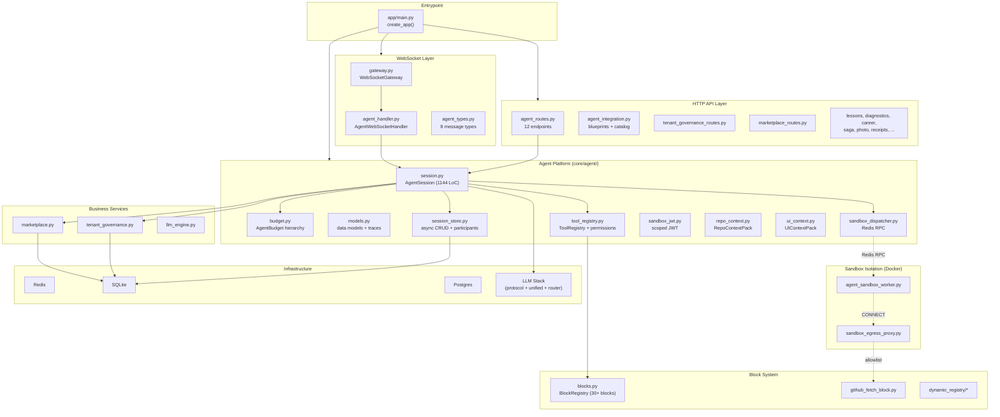
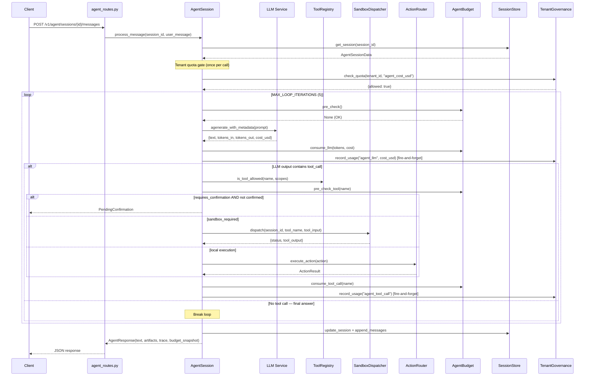
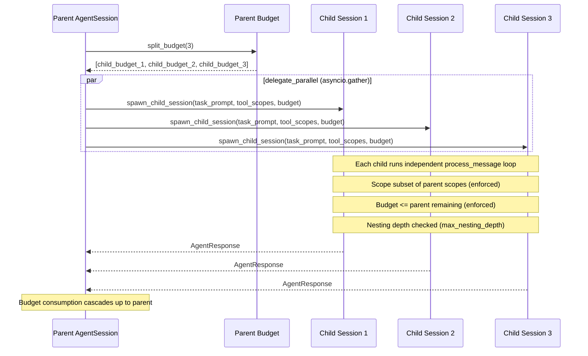
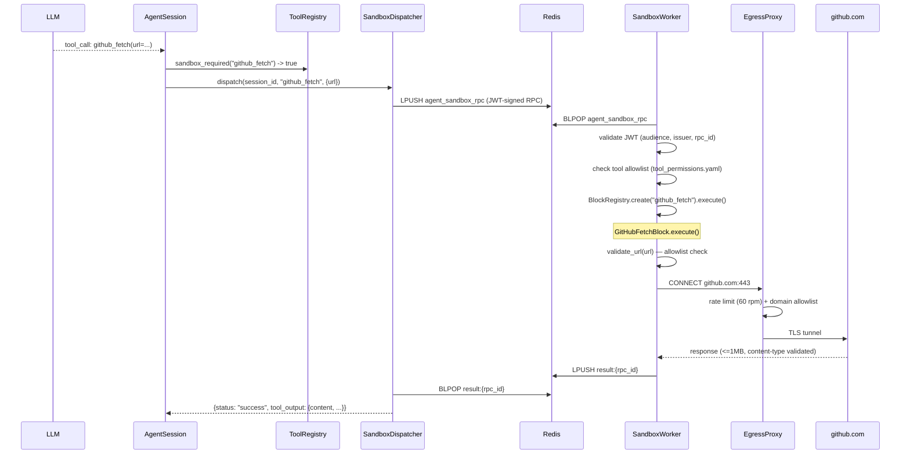
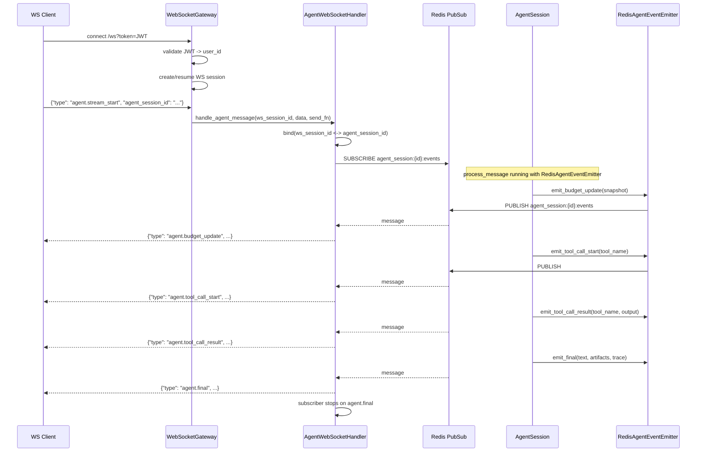
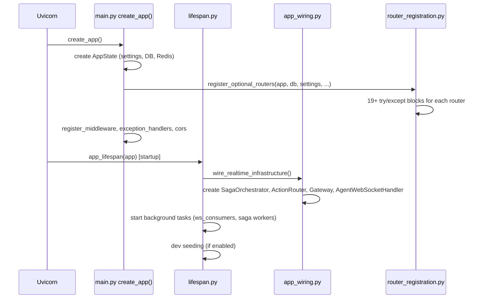

# Seed Server — Architecture Map (Post Phase 5 + Phase 0 Agent Platform)

> **Generated:** 2026-03-02 · **Updated:** 2026-02-27
> **Test suite:** 1350 passed, 22 skipped, 3 failed (pre-existing demo store issue) — `python -m pytest tests/ -q --tb=no --timeout=120`
> **Unit tests:** 1236 passed, 7 skipped — `python -m pytest tests/unit -q --tb=no --timeout=120`
> **Integration tests:** 61 passed, 2 skipped, 3 failed (pre-existing) — `python -m pytest tests/integration -q --tb=no --timeout=30`
> **Python:** 3.12.10 · **Framework:** FastAPI · **DB:** SQLite (core) + Postgres (sagas)
> **main.py measured:** 459 total lines / 398 non-blank — `python -c "len(open('app/main.py').readlines())"` on 2026-02-27
> **Phase 5 delta:** main.py 3 837 → 443 lines · 16 extracted modules · LLM protocol + DI layer
> **Phase 0 delta:** +26 agent platform files · +11 integration tests · +46 unit test files for agent subsystem · multi-agent, multi-user, sandbox, marketplace, tenant governance

---

## Table of Contents

0. [60-Second Overview](#0-60-second-overview)
1. [Executive Summary](#1-executive-summary)
2. [Repository Architecture Map](#2-repository-architecture-map)
3. [Key Entrypoints Map](#3-key-entrypoints-map)
4. [Runtime Flows](#4-runtime-flows)
5. [Dependency Injection Map](#5-dependency-injection-map)
6. [Unified LLM Stack Map](#6-unified-llm-stack-map)
7. [Agent Platform Architecture](#7-agent-platform-architecture)
8. [Security & Governance Model](#8-security--governance-model)
9. [Observability & Artifacts](#9-observability--artifacts)
10. [CI / Test Reality Check](#10-ci--test-reality-check)
11. [Delta since Last Map](#11-delta-since-last-map)
12. [Database Semantics: SQLite vs Postgres](#12-database-semantics-sqlite-vs-postgres)
13. [Open Risks & Recommendations](#13-open-risks--recommendations)
14. [Do Not Change List](#14-do-not-change-list)

---

## 0. 60-Second Overview

- **What:** Seed Server is a FastAPI backend that orchestrates AI-powered learning, diagnostics, career coaching, and food-tech (NeoEats) workflows via pluggable LLM providers — now extended with a full **agent session platform** supporting multi-agent orchestration, multi-user collaboration, sandbox-isolated tool execution, and real-time WebSocket streaming.
- **What it enables:** Real-time action routing over WebSocket, multi-step saga orchestration with retry/DLQ/compensation, streaming lesson/diagnostic generation, **and an agentic tool-calling loop with parent-child sessions, budget hierarchy, and tenant-scoped billing** — all behind JWT auth and tenant governance.
- **Key differentiator:** Production saga engine with distributed locking, event bus, artifact telemetry, LLM output validation + repair loops, unified provider-switching facade, **and a turnkey agent platform with sandbox worker, egress proxy, marketplace settlement, confirmation gates, and per-tenant quota enforcement**.
- **Main verticals:** EdTech (lessons, diagnostics, career paths, upskilling), FoodTech/NeoEats (inventory, orders, receipt scanning, cooking mode), **and a horizontal Agent Platform** (tool orchestration, context injection, multi-user sessions).

### 0.1 Quick Start

```bash
# Local dev (requires Docker — starts Postgres, Redis, API, sandbox, proxy):
docker compose up --build          # see docker-compose.yml

# Run unit tests (no Docker needed, SQLite in-memory + stub LLM):
make test                          # or: python -m pytest -q

# Health check:
curl http://localhost:8000/health
```

> Commands verified against `Makefile` (targets: `run`, `test`, `clean`) and `docker-compose.yml` (services: `postgres`, `redis`, `api`, `scheduler`, `worker_fast`, `worker_batch`, `worker_low`, `agent_sandbox`, `sandbox_egress_proxy`).

---

## 1. Executive Summary

Phase 5 completed a major architecture refactor (monolithic `main.py` 3 837 → 443 lines). Phase 0 ("Phase 0 Agent Platform Expansion") added a complete agent session subsystem with multi-agent, multi-user, sandbox, marketplace, and tenant governance.

| Metric | Pre-Phase 5 | Post-Phase 5 | Post-Phase 0 (current) |
|---|---|---|---|
| `main.py` LoC | 3 837 | 443 | 459 |
| Extracted infrastructure modules | 0 | 9 | 9 |
| DI providers (FastAPI `Depends`) | 0 | 5 | 5 |
| LLM protocol types | 0 | 2 | 2 |
| Agent platform modules | 0 | 0 | 11 (`app/core/agent/*`) |
| Agent API routes | 0 | 0 | 12 endpoints |
| WS agent message types | 0 | 0 | 8 |
| Sandbox services (compose) | 0 | 0 | 2 (`agent_sandbox`, `sandbox_egress_proxy`) |
| Tenant governance tables | 0 | 0 | 6 |
| Marketplace tables | 0 | 0 | 4 |
| Unit test count | 632 | 656 | **1236 passed, 7 skipped** |
| Integration test count | — | — | **61 passed, 2 skipped** |
| Total test count | 632 | 656 | **1350 passed, 22 skipped** |

---

## 2. Repository Architecture Map

### 2.1 Top-Level File Tree

```
seed_server/
├── app/                              # Application package
│   ├── main.py                       # Application factory (create_app, 459 LoC)
│   ├── settings.py                   # Settings dataclass (env-driven)
│   ├── dependencies.py               # FastAPI DI providers (5 providers, 41 LoC)
│   ├── agent_sandbox_worker.py       # Sandbox worker entrypoint (254 LoC) — NEW Phase 0
│   ├── worker_main.py                # Photo editing async job processor
│   ├── api/                          # HTTP & WebSocket routers (34 modules)
│   │   ├── agent_routes.py           #   /v1/agent/* — 12 endpoints (612 LoC) — NEW Phase 0
│   │   ├── agent_integration.py      #   /v1/blueprints/*, /v1/catalog/* (565 LoC)
│   │   ├── tenant_governance_routes.py #  /v1/admin/tenants/* (228 LoC) — NEW Phase 0
│   │   ├── marketplace_routes.py     #   /v1/marketplace/*, /v1/admin/marketplace/* (220 LoC) — NEW Phase 0
│   │   ├── ws/                       #   WebSocket subsystem
│   │   │   ├── gateway.py            #     WebSocketGateway (505 LoC)
│   │   │   ├── agent_handler.py      #     AgentWebSocketHandler + RedisAgentEventEmitter (266 LoC) — NEW Phase 0
│   │   │   ├── agent_types.py        #     8 WS message types (216 LoC) — NEW Phase 0
│   │   │   ├── auth.py               #     JWT handler re-export
│   │   │   ├── session.py            #     WS session management
│   │   │   └── types.py              #     Base WS message types
│   │   ├── actions_endpoint.py       #   /v1/actions, /v1/personas
│   │   ├── auth_routes.py            #   /api/v1/auth/*
│   │   ├── console_runtime.py        #   /v1/modules, /v1/flows, /v1/runs
│   │   ├── deprecated_routes.py      #   501-returning stubs
│   │   └── ...                       #   (lessons, diagnostics, career, saga, photo, receipts, ...)
│   ├── core/                         # Domain logic
│   │   ├── agent/                    #   Agent platform subsystem — NEW Phase 0
│   │   │   ├── session.py            #     AgentSession orchestrator (1144 LoC)
│   │   │   ├── budget.py             #     AgentBudget with parent-child hierarchy (314 LoC)
│   │   │   ├── models.py             #     AgentSessionData, AgentResponse, traces, participants (421 LoC)
│   │   │   ├── session_store.py      #     AgentSessionStore — async CRUD + participants (233 LoC)
│   │   │   ├── tool_registry.py      #     ToolRegistry + ToolPermissionConfig (263 LoC)
│   │   │   ├── tool_permissions.yaml #     Per-tool security policy (47 lines)
│   │   │   ├── sandbox_dispatcher.py #     Redis RPC dispatcher to sandbox worker (130 LoC)
│   │   │   ├── sandbox_jwt.py        #     Scoped JWT for sandbox RPC calls (130 LoC)
│   │   │   ├── repo_context.py       #     RepoContextPack + RepoFileCache (206 LoC)
│   │   │   └── ui_context.py         #     UIContextPack Pydantic models (143 LoC)
│   │   ├── blocks.py                 #     BlockBase, BlockMetadata, BlockRegistry (577 LoC)
│   │   ├── auth.py, authz.py         #     Authentication & authorization (authz: 403 LoC)
│   │   ├── llm/                      #     LLM subsystem
│   │   │   ├── protocol.py           #       LLMProvider / LLMVisionProvider protocols (88 LoC)
│   │   │   ├── unified.py            #       UnifiedLLMService facade (239 LoC)
│   │   │   ├── router.py             #       OpenAI / Gemini / Stub providers + execute_action()
│   │   │   ├── pricing.py            #       Cost registry
│   │   │   └── validator.py          #       Output validation
│   │   ├── realtime/                 #     WebSocket & action routing
│   │   │   ├── action_router.py      #       ActionRouter (saga-aware, idempotent)
│   │   │   ├── ws_consumers.py       #       forward_router_responses, consume_action_router_messages
│   │   │   └── sagas/                #       Saga orchestrator & adapters
│   │   └── security/jwt.py
│   ├── dynamic_registry/             # Dynamically loaded blocks
│   │   ├── github_fetch_block.py     #   GitHubFetchBlock (298 LoC) — NEW Phase 0
│   │   ├── inventory_sync_block.py
│   │   ├── recipe_generator_block.py
│   │   └── loader.py
│   ├── infrastructure/               # Cross-cutting infrastructure (Phase 5 extractions)
│   │   ├── app_wiring.py             #   wire_realtime_infrastructure() (250 LoC)
│   │   ├── lifespan.py               #   app_lifespan() context manager (140 LoC)
│   │   ├── router_registration.py    #   register_optional_routers() (211 LoC)
│   │   ├── middleware_setup.py        #   register_middleware() (93 LoC)
│   │   ├── exception_handlers.py     #   register_exception_handlers() (63 LoC)
│   │   ├── cors.py                   #   configure_cors()
│   │   ├── dev_helpers.py            #   Dev seeding (users, inventory, catalog)
│   │   ├── db/                       #   SQLite, Postgres, NeoEats, Catalog
│   │   ├── redis/                    #   Queue, SSE, Usage, Cache, Worker
│   │   └── monitoring/               #   Prometheus metrics
│   ├── middleware/
│   │   └── request_id.py             # RequestIDMiddleware (X-Request-ID)
│   ├── models/                       # Pydantic models
│   ├── services/                     # Business services
│   │   ├── tenant_governance.py      #   TenantGovernanceService (879 LoC) — NEW Phase 0
│   │   ├── marketplace.py            #   MarketplaceService (843 LoC) — NEW Phase 0
│   │   ├── llm_engine.py, flavor_architect.py, receipt_vision_engine.py ...
│   │   └── ...
│   └── ...
├── scripts/
│   ├── sandbox_egress_proxy.py       # CONNECT-only proxy for sandbox (242 LoC) — NEW Phase 0
│   └── ...
├── tests/                            # 1350+ tests
│   ├── unit/                         # 1236 passed, 7 skipped (91 test files)
│   │   ├── test_agent_*.py           #   46 agent-related test files
│   │   └── ...
│   ├── integration/                  # 61 passed, 2 skipped
│   │   ├── test_agent_demo_scenario.py
│   │   ├── test_agent_github_fetch_demo.py   — NEW Phase 0
│   │   ├── test_agent_multi_agent_demo.py    — NEW Phase 0
│   │   ├── test_agent_tenant_demo.py         — NEW Phase 0
│   │   ├── test_agent_ws_demo.py             — NEW Phase 0
│   │   ├── test_ws_action_flow.py
│   │   └── ...
│   └── ...
├── .github/workflows/                # 11 CI workflows
├── migrations/                       # Alembic (Postgres)
├── docker-compose.yml                # 9 services — NEW: agent_sandbox, sandbox_egress_proxy
├── Dockerfile                        # Production image (non-root, healthcheck)
└── pyproject.toml                    # Build + pytest config
```

### 2.2 Subsystem Diagram



---

## 3. Key Entrypoints Map

| # | File | Function / Symbol | LoC | Responsibilities |
|---|---|---|---|---|
| 1 | `app/main.py` | `create_app()` | 459 | Application factory — orchestrates all init steps, returns `FastAPI` instance |
| 2 | `app/main.py` | `AppState` | — | Typed container for `settings`, `db`, `redis`, `queuehub`, `broker`; stored at `app.state.seed` |
| 3 | `app/infrastructure/lifespan.py` | `app_lifespan()` | 140 | Async context manager: startup (Postgres pool, realtime tasks, saga init, dev seeding) / shutdown (cancel tasks, close connections, metrics) |
| 4 | `app/infrastructure/app_wiring.py` | `wire_realtime_infrastructure()` | 250 | Creates `SagaOrchestrator`, 8 saga adapters, `ActionRouter`, `WebSocketGateway` + `AgentWebSocketHandler`, `OrderStreamHub`; attaches to `app.state` |
| 5 | `app/infrastructure/router_registration.py` | `register_optional_routers()` | 211 | 19+ try/except-guarded router imports including `agent_routes`, `tenant_governance_routes`, `marketplace_routes` |
| 6 | `app/infrastructure/middleware_setup.py` | `register_middleware()` | 93 | Middleware stack: RequestIDMiddleware -> metrics -> auth-context -> security-headers/body-limit |
| 7 | `app/infrastructure/exception_handlers.py` | `register_exception_handlers()` | 63 | HTTPException, StarletteHTTPException, catch-all (no stack leaks) |
| 8 | `app/api/agent_routes.py` | `build_agent_router()` | 612 | **NEW:** 12 REST endpoints for agent sessions, messages, participants, context, tools |
| 9 | `app/api/ws/agent_handler.py` | `AgentWebSocketHandler` | 266 | **NEW:** WS-to-agent binding, Redis pub/sub event forwarding |
| 10 | `app/api/ws/gateway.py` | `WebSocketGateway` | 505 | JWT-authenticated WS endpoint at `/ws`; delegates `agent.*` messages to `AgentWebSocketHandler` |
| 11 | `app/agent_sandbox_worker.py` | `main()` | 254 | **NEW:** Sandbox worker process — BLPOP Redis RPC queue, execute blocks in isolation, push results |
| 12 | `scripts/sandbox_egress_proxy.py` | `main()` | 242 | **NEW:** CONNECT-only TCP proxy for sandbox egress — domain allowlist + rate limiting |
| 13 | `app/core/realtime/ws_consumers.py` | `forward_router_responses()` | — | Infinite loop: `response_queue` -> broadcasting via `WebSocketGateway` (8+ message types) |
| 14 | `app/core/realtime/ws_consumers.py` | `consume_action_router_messages()` | — | Infinite loop: `action_router_queue` -> dispatching to `ActionRouter` |
| 15 | `app/core/realtime/sagas/background_workers.py` | Three loops | — | archive_waiting_confirm, recover_stuck_sagas, dlq_maintenance |
| 16 | `app/worker_main.py` | `WorkerService.run()` | — | Photo editing async job processor (separate process) |

### 3.1 Agent REST API Endpoints (`/v1/agent`)

Source: `app/api/agent_routes.py` — `build_agent_router()`

| # | Method | Path | Handler | Purpose |
|---|---|---|---|---|
| 1 | POST | `/v1/agent/sessions` | `create_session` | Create agent session (optionally with tenant_id, project_id) |
| 2 | POST | `/v1/agent/sessions/{id}/messages` | `send_message` | Send message -> LLM -> tool loop -> response |
| 3 | GET | `/v1/agent/sessions/{id}` | `get_session` | Session details + messages + children |
| 4 | POST | `/v1/agent/sessions/{id}/persona` | `update_persona` | Update persona_id and overrides |
| 5 | DELETE | `/v1/agent/sessions/{id}` | `delete_session` | Cancel session tree (cascade) |
| 6 | GET | `/v1/agent/sessions/{id}/tree` | `get_session_tree` | BFS session tree traversal |
| 7 | GET | `/v1/agent/tools` | `list_tools` | All tool manifests for current scopes |
| 8 | POST | `/v1/agent/sessions/{id}/participants` | `add_participant` | Add user to session |
| 9 | DELETE | `/v1/agent/sessions/{id}/participants/{uid}` | `remove_participant` | Remove user from session |
| 10 | GET | `/v1/agent/sessions/{id}/participants` | `list_participants` | List session participants |
| 11 | POST | `/v1/agent/sessions/{id}/context` | `ingest_context` | Push UI context pack |
| 12 | POST | `/v1/agent/sessions/{id}/repo-context` | `ingest_repo_context` | Push repo context pack |

### 3.2 Tenant Governance Admin Endpoints (`/v1/admin/tenants`)

Source: `app/api/tenant_governance_routes.py` — all require admin key.

| Method | Path | Purpose |
|---|---|---|
| POST | `/v1/admin/tenants` | Upsert tenant org |
| POST | `/v1/admin/tenants/{id}/projects` | Upsert project |
| POST | `/v1/admin/tenants/{id}/roles` | Grant role |
| POST | `/v1/admin/tenants/{id}/quotas` | Set quota |
| POST | `/v1/admin/tenants/{id}/usage/check` | Check quota |
| POST | `/v1/admin/tenants/{id}/usage/record` | Record usage event |
| GET | `/v1/admin/tenants/{id}/usage/export` | Export usage |
| GET | `/v1/admin/tenants/{id}/audit` | Audit log |
| GET | `/v1/admin/tenants/{id}/governance` | Full governance snapshot |

### 3.3 Marketplace Endpoints (`/v1/marketplace`)

Source: `app/api/marketplace_routes.py`

| Method | Path | Auth | Purpose |
|---|---|---|---|
| GET | `/v1/marketplace/modules` | public/admin | List modules |
| GET | `/v1/marketplace/modules/{id}` | public/admin | Module details |
| GET | `/v1/marketplace/modules/{id}/reputation` | public | Reputation stats |
| POST | `/v1/marketplace/modules/{id}/ratings` | user | Upsert rating |
| POST | `/v1/admin/marketplace/modules` | admin | Upsert listing |
| POST | `/v1/admin/marketplace/modules/{id}/sandbox-policy` | admin | Update sandbox policy |
| POST | `/v1/admin/marketplace/modules/{id}/billing-policy` | admin | Update billing policy |
| GET | `/v1/admin/marketplace/modules/{id}/usage/export` | admin | Export usage |
| POST | `/v1/admin/marketplace/settlements/run` | admin | Run settlement |
| GET | `/v1/admin/marketplace/payouts` | admin | List payouts |
| GET | `/v1/admin/marketplace/payouts/{id}` | admin | Payout details |

---

## 4. Runtime Flows

### 4.1 Agent Session Loop (Multi-Step)

Source: `app/core/agent/session.py` — `AgentSession.process_message()`



### 4.2 Multi-Agent Orchestration

Source: `app/core/agent/session.py` — `spawn_child_session()`, `delegate_parallel()`



**Key constraints:**
- Child tool scopes must be a **subset** of parent scopes (`session.py`)
- Child budget is **capped at parent remaining** (`budget.py` — `create_child()`)
- Nesting depth enforced: default `max_nesting_depth=3` (`session.py`)
- Parallel delegation capped at `max_parallel=5` (`session.py`)
- Session tree: `session_store.get_session_tree()` — BFS traversal; `cancel_session_tree()` cascades

### 4.3 Multi-User Session Collaboration

Source: `app/core/agent/models.py` — `SessionParticipant`, `ParticipantRole`; `session_store.py` — participant CRUD

```
Session Owner creates session
  POST /v1/agent/sessions
  -> AgentSessionData(user_id=owner, ...)
  -> auto-added as participant (OWNER role)

  POST /v1/agent/sessions/{id}/participants
  -> add_participant(user_id, role=EDITOR|VIEWER)
  -> tool_scopes can be restricted per participant

  POST /v1/agent/sessions/{id}/messages
  -> sender_user_id tracked on each message
  -> budget.consume_llm(user_id=sender) per-user cost
  -> budget.consume_tool_call(user_id=sender)
  -> budget.per_user_consumption dict for attribution

  DELETE /v1/agent/sessions/{id}/participants/{uid}
  -> soft-remove (set left_at); OWNER cannot be removed
```

**Roles:** `OWNER` (full control), `EDITOR` (send messages, tool scopes), `VIEWER` (read-only).

### 4.4 GitHub Integration Flow

Source: `app/dynamic_registry/github_fetch_block.py`, `app/core/agent/sandbox_dispatcher.py`, `scripts/sandbox_egress_proxy.py`



**Security layers:**
1. `tool_permissions.yaml`: `github_fetch` -> `sandbox_required: true`, `allowed_in_sandbox: true`
2. Sandbox JWT: scoped per-RPC, 60s TTL, single-use (`sandbox_jwt.py`)
3. Sandbox worker: no API keys in env, read-only rootfs, tmpfs, `cap_drop: ALL`
4. Egress proxy: CONNECT-only, domain allowlist (`github.com`, `api.github.com`, `raw.githubusercontent.com`, `codeload.github.com`), 60 rpm rate limit, 5MB body cap
5. `GitHubFetchBlock`: URL allowlist, max 2 redirects (each validated), 1MB response cap, content-type validation
6. Repo context injection: `RepoContextPack` — `MAX_TOTAL_CONTENT_BYTES=200KB`, `MAX_FILE_ENTRIES=50`, `MAX_TREE_BYTES=50KB`

### 4.5 WS Agent Streaming Flow

Source: `app/api/ws/agent_handler.py`, `app/api/ws/agent_types.py`, `app/api/ws/gateway.py`



**WS Message Types** (all carry `agent_session_id`, `message_id`, `correlation_id`, `request_id`, `timestamp`):

| Type | Direction | Fields |
|---|---|---|
| `agent.stream_start` | Client -> Server | `agent_session_id` |
| `agent.partial` | Server -> Client | `content`, `index` |
| `agent.tool_call_start` | Server -> Client | `tool_name`, `input_preview` |
| `agent.tool_call_result` | Server -> Client | `tool_name`, `output_summary`, `duration_ms`, `status`, `file_references` |
| `agent.confirmation_request` | Server -> Client | `confirmation_id`, `tool_name`, `proposed_input`, `diff`, `description` |
| `agent.budget_update` | Server -> Client | `budget_snapshot` |
| `agent.final` | Server -> Client | `text`, `artifacts`, `trace`, `file_references`, `stopped_reason`, `budget_snapshot` |
| `agent.error` | Server -> Client | `error`, `recoverable` |

### 4.6 Application Startup (unchanged from Phase 5)



---

## 5. Dependency Injection Map

### 5.1 Central Providers (`app/dependencies.py`, 41 LoC)

| Provider | Return Type | Source |
|---|---|---|
| `get_db` | `DB` (SQLite) | `request.app.state.seed.db` |
| `get_redis` | `redis.asyncio.Redis` | `request.app.state.seed.redis` |
| `get_settings_dep` | `Settings` | `request.app.state.seed.settings` |
| `get_hub` | `RedisQueueHub` | `request.app.state.seed.queuehub` |
| `get_broker` | `RedisEventBroker` | `request.app.state.seed.broker` |

### 5.2 Constructor-Pattern Routers

10+ routers use factory pattern (`build_*_router(db=db, ...)`). Dependencies passed as closure variables at creation time in `create_app()`. Includes the new `build_agent_router()`, `build_tenant_governance_router()`, `build_marketplace_router()`.

---

## 6. Unified LLM Stack Map

### 6.1 Protocol Layer (`app/core/llm/protocol.py`, 88 LoC)

```python
@runtime_checkable
class LLMProvider(Protocol):
    provider_name: str
    def is_available(self) -> bool: ...
    def generate(*, prompt, system_instruction, model, temperature, max_tokens, response_format) -> str: ...
    async def agenerate(*, prompt, system_instruction, model, temperature, max_tokens, response_format) -> str: ...

@runtime_checkable
class LLMVisionProvider(Protocol):
    provider_name: str
    def is_available(self) -> bool: ...
    async def agenerate_with_image(*, prompt, image_bytes, mime_type, model, temperature, max_tokens) -> str: ...
```

### 6.2 Provider Conformance Matrix

| Class | Module | `LLMProvider` | `LLMVisionProvider` | `provider_name` |
|---|---|---|---|---|
| `GeminiClientAdapter` | `core/llm/unified.py` | Yes | Yes | `"gemini"` |
| `OpenAIProvider` | `core/llm/router.py` | Yes | No | `"openai"` |
| `GeminiProvider` | `core/llm/router.py` | Yes | No | `"gemini"` |
| `StubProvider` | `core/llm/router.py` | Yes | No | `"stub"` |

### 6.3 Facade (`app/core/llm/unified.py`, 239 LoC)

`UnifiedLLMService` — multi-provider facade. Currently only `GeminiClientAdapter` registered at startup; `OpenAI` + `Stub` providers conform but are not registered.

### 6.4 Agent LLM Integration

`AgentSession` receives an `llm_service` via constructor injection. It calls `llm_service.agenerate_with_metadata()` which returns `{text, tokens_in, tokens_out, cost_usd}`. This is a separate interface from `UnifiedLLMService.agenerate()` (which returns `str` only). The agent LLM adapter returns structured metadata needed for budget tracking.

---

## 7. Agent Platform Architecture

### 7.1 Module Map

| File | LoC | Purpose |
|---|---|---|
| `app/core/agent/session.py` | 1144 | `AgentSession` — main orchestrator, multi-step LLM-tool loop, event emission, tenant/marketplace hooks |
| `app/core/agent/budget.py` | 314 | `AgentBudget` — per-session budget with parent-child hierarchy, per-user cost tracking, async lock |
| `app/core/agent/models.py` | 421 | Data models: `AgentSessionData`, `AgentSessionMessage`, `AgentResponse`, `AgentTrace`, `AgentTraceStep`, `SessionParticipant`, `PendingConfirmation`, `PersonaOverrides` |
| `app/core/agent/session_store.py` | 233 | `AgentSessionStore` — async CRUD, message persistence, participant CRUD, session tree traversal |
| `app/core/agent/tool_registry.py` | 263 | `ToolRegistry` + `ToolPermissionConfig` — default-deny tool catalog with scope, confirmation, and sandbox enforcement |
| `app/core/agent/tool_permissions.yaml` | 47 | Per-tool security policy (see section 8.2) |
| `app/core/agent/sandbox_dispatcher.py` | 130 | `SandboxDispatcher` — API-side Redis RPC to sandbox worker |
| `app/core/agent/sandbox_jwt.py` | 130 | `issue_sandbox_token()` / `validate_sandbox_token()` — scoped JWT for sandbox calls |
| `app/core/agent/repo_context.py` | 206 | `RepoContextPack` + `RepoFileCache` — structured repo context with size limits |
| `app/core/agent/ui_context.py` | 143 | `UIContextPack` — UI component/route/contract context for LLM |
| `app/core/blocks.py` | 577 | `BlockBase`, `BlockMetadata` (with `listing_id`), `BlockRegistry` — 30+ registered blocks |

### 7.2 `AgentSession` Constructor Dependencies

Source: `app/core/agent/session.py`

| Parameter | Type | Required | Purpose |
|---|---|---|---|
| `session_store` | `AgentSessionStore` | Yes | Persist session + messages |
| `tool_registry` | `ToolRegistry` | Yes | Tool catalog + permission enforcement |
| `action_router` | `ActionRouter` | Yes | Local tool execution |
| `llm_service` | Any (LLM adapter) | Yes | LLM generation with metadata |
| `artifact_store` | Any | No | Artifact persistence (optional) |
| `persona_loader` | Any | No | Persona system prompt resolution |
| `auth_context` | Any | No | User auth context |
| `audit_emitter` | `Callable` | No | Audit event emission |
| `sandbox_dispatcher` | `SandboxDispatcher` | No | Remote sandbox execution |
| `sandbox_enabled` | `bool` | No | Enable sandbox routing |
| `nesting_depth` | `int` | No | Current depth (for multi-agent) |
| `max_nesting_depth` | `int` | No | Max allowed (default 3) |
| `event_emitter` | `AgentEventEmitter` | No | WS streaming events (default no-op) |
| `tenant_governance` | `TenantGovernanceService` | No | Tenant usage + quota enforcement |
| `marketplace_service` | `MarketplaceService` | No | Marketplace usage recording |

### 7.3 Budget Hierarchy

Source: `app/core/agent/budget.py`

```
Parent Budget (max_tokens=10000, max_cost=5.0, max_tool_calls=20)
+-- create_child(max_tokens=3000, ...) -> capped at min(requested, remaining)
|   +-- consume_llm() -> cascades to parent
+-- split_budget(3) -> 3 equal children from remaining
|   +-- Child A: consume_tool_call() -> cascades to parent
|   +-- Child B: consume_tool_call() -> cascades to parent
|   +-- Child C: consume_tool_call() -> cascades to parent
+-- per_user_consumption: Dict[user_id, {tokens, cost, tool_calls}]
```

**Budget fields:** `max_total_tokens`, `max_total_cost_units`, `max_wall_time_seconds`, `max_tool_calls`, `per_tool_limits` (Dict[tool_name, int]).

### 7.4 Tenant Governance

Source: `app/services/tenant_governance.py` — 879 LoC

**6 SQLite tables:** `tenant_orgs`, `tenant_projects`, `tenant_memberships`, `tenant_quotas`, `tenant_usage_events`, `tenant_audit_log`

**Key operations:**
- `upsert_tenant` / `upsert_project` — org hierarchy
- `grant_role` — owner | admin | operator | viewer | billing
- `set_quota` — per operation, per window (minute|hour|day|month), per metric (quantity|cost_usd|credits)
- `check_quota` -> `{allowed, checks, violations}`
- `record_usage` — with idempotency dedup (in-memory, 1hr TTL) and optional quota enforcement
- `export_usage` — per-operation totals
- `governance_snapshot` — full tenant state

**Agent integration (P0-37/38):**
- `_record_tenant_usage_fire_and_forget()` in `AgentSession` — called after each `consume_llm()` and `consume_tool_call()` with idempotency keys (`{session_id}:llm:{iteration}`, `{session_id}:tool:{name}:{monotonic_ms}`)
- Tenant quota gate in `process_message()` — called **once** per invocation, cached for loop duration. Operation: `agent_cost_usd`. If `allowed=False` -> `stopped_reason="tenant_quota_exceeded"`. Error -> fallback to allow.

### 7.5 Marketplace Service

Source: `app/services/marketplace.py` — 843 LoC

**4 SQLite tables:** `marketplace_modules`, `marketplace_ratings`, `marketplace_usage_events`, `marketplace_payout_ledger`

**Agent integration (P0-39):**
- `_record_marketplace_usage()` in `AgentSession._execute_tool()` — looks up `listing_id` from `BlockMetadata`, calls `marketplace_service.record_usage_event(module_id=listing_id, event_type="agent_tool_call")` with auto-computed revenue split.

---

## 8. Security & Governance Model

### 8.1 AuthZ: Agent Scope Family

Source: `app/core/authz.py` — `ROLE_SCOPES` dict

| Scope | user | developer | operator | admin |
|---|---|---|---|---|
| `agent:sessions` | Yes | Yes | Yes | Yes (*) |
| `agent:tools:read` | Yes | Yes | Yes | Yes (*) |
| `agent:tools:execute` | No | Yes | Yes | Yes (*) |
| `agent:context:read` | Yes | Yes | Yes | Yes (*) |
| `agent:persona:write` | No | Yes | Yes | Yes (*) |
| `admin:tools:execute` | No | No | No | Yes (*) |

(*) admin has wildcard `"*"` scope.

### 8.2 Tool Permissions (YAML)

Source: `app/core/agent/tool_permissions.yaml`

| Tool | `require_scope` | `sandbox_required` | `allowed_in_sandbox` | `requires_confirmation` | `max_calls_per_session` |
|---|---|---|---|---|---|
| *(defaults)* | `agent:tools:execute` | false | false | false | null |
| `inventory_sync` | `agent:tools:execute` | **true** | **true** | **true** | 5 |
| `recipe_generator` | `agent:tools:execute` | false | — | false | — |
| `menu_lookup` | `agent:tools:execute` | false | — | false | — |
| `admin_reset` | `admin:tools:execute` | false | — | **true** | 1 |
| `github_fetch` | `agent:tools:execute` | **true** | **true** | false | 20 |

### 8.3 Confirmation Gate

Source: `app/core/agent/session.py` — `_execute_tool()`

1. `ToolPermissionConfig.requires_confirmation(tool_name)` checked before execution
2. If required and not already confirmed -> `PendingConfirmation` created with unique `confirmation_id`
3. Stored in `session.pending_confirmations` (persisted via `update_session()`)
4. Client receives confirmation request (WS: `agent.confirmation_request`, REST: in `AgentResponse.pending_confirmations`)
5. Next user message containing "confirm"/"cancel" resolved by `_resolve_confirmation()`
6. Per-user: confirmation scoped to `user_id` who initiated the tool call
7. **Cannot bypass:** tool execution is gated by confirmation check in `_execute_tool()` — no alternate code path

### 8.4 Sandbox Worker Constraints

Source: `app/agent_sandbox_worker.py`, `docker-compose.yml`

| Constraint | Implementation | Evidence |
|---|---|---|
| No API keys | Startup aborts if `SEED_OPENAI_API_KEY`, `DATABASE_URL`, or `SEED_DB_PATH` present | `agent_sandbox_worker.py` startup checks |
| Read-only rootfs | `read_only: true` | `docker-compose.yml` `agent_sandbox` service |
| tmpfs work dir | `tmpfs: /work:size=100M,noexec` | `docker-compose.yml` |
| Drop all capabilities | `cap_drop: ALL` | `docker-compose.yml` |
| No privilege escalation | `no-new-privileges: true` | `docker-compose.yml` |
| Internal network only | `agent_sandbox_net: internal: true` | `docker-compose.yml` |
| Egress via proxy only | `HTTPS_PROXY=http://sandbox_egress_proxy:3128` | `docker-compose.yml` environment |
| JWT-scoped per RPC | `validate_sandbox_token()` checks aud, iss, rpc_id, tool_name | `sandbox_jwt.py` |
| Replay protection | In-memory LRU set (10K) rejects duplicate rpc_ids | `agent_sandbox_worker.py` |
| Tool allowlist | Only `allowed_in_sandbox: true` tools execute | `agent_sandbox_worker.py` `_load_sandbox_allowlist()` |

### 8.5 Egress Proxy Constraints

Source: `scripts/sandbox_egress_proxy.py`

| Constraint | Value |
|---|---|
| Method | CONNECT only (HTTP 405 for all others) |
| Allowlist | `github.com`, `api.github.com`, `raw.githubusercontent.com`, `codeload.github.com` |
| Rate limit | 60 requests/minute per source IP |
| Max body | 5 MB |
| Connect timeout | 5 seconds |
| Read timeout | 15 seconds |
| Container | `read_only: true`, `cap_drop: ALL`, `cap_add: NET_BIND_SERVICE` |

### 8.6 Repo Context Injection Hardening

Source: `app/core/agent/repo_context.py`

| Limit | Value | Enforced by |
|---|---|---|
| Total content bytes | 200 KB | `MAX_TOTAL_CONTENT_BYTES`, `RepoContextPack.validate()` |
| Max file entries | 50 | `MAX_FILE_ENTRIES`, `validate()` |
| Max tree bytes | 50 KB | `MAX_TREE_BYTES`, `validate()` |
| Prompt file limit | 30 files | `PROMPT_FILE_LIMIT`, `to_prompt_section()` |
| Prompt tree chars | 3000 | `PROMPT_TREE_CHARS`, `to_prompt_section()` |

Content is treated as untrusted: injected into prompt with clear `<repo_context>` delimiters; LLM system prompt instructs the model to treat it as reference only.

### 8.7 Existing Security Controls (unchanged from Phase 5)

| # | Item | Status | Evidence |
|---|---|---|---|
| 1 | X-Request-ID middleware | Active | `app/middleware/request_id.py` |
| 2 | Catch-all exception handler | Active | `app/infrastructure/exception_handlers.py` |
| 3 | No stack trace leakage | Active | Fixed 500 body: `{"detail":"internal_server_error"}` |
| 4 | Timing-safe comparisons | Active | 5 `hmac.compare_digest()` sites |
| 5 | Security headers | Active | `middleware_setup.py` — nosniff, DENY, HSTS |
| 6 | Docker non-root + healthcheck | Active | `Dockerfile` — `appuser`, `HEALTHCHECK` |
| 7 | JWT auth for WS | Active | `gateway.py` — `token` query param required, close 4001 on failure |

---

## 9. Observability & Artifacts

### 9.1 Agent Trace Artifacts

Source: `app/core/agent/models.py` — `AgentTrace`, `AgentTraceStep`

Every `process_message()` call produces an `AgentTrace` containing:
- `trace_id` (UUID), `session_id`, `user_id`, `parent_trace_id`
- `steps: List[AgentTraceStep]` — each step records:
  - `step_type` (e.g., `llm_call`, `tool_executed`, `tool_executed_sandbox`, `scope_check`, `confirmation_requested`)
  - `tool_name`, `tool_input_hash`, `tool_output_hash` (SHA-256 hashes, not raw data)
  - `duration_ms`, `budget_snapshot`, `scope_check_result`, `extra`
- Timestamps: `started_at`, `finished_at`

Trace is included in `AgentResponse.trace` and `AgentFinal` WS message.

### 9.2 Audit Events

Source: `app/core/agent/session.py` — `_emit_audit()`

Audit events emitted for:
- Session creation / update / deletion
- Tool execution (with tool_name, session_id, user_id)
- Persona changes
- Confirmation requests and resolutions
- Budget exceeded / tenant quota exceeded
- Sandbox dispatch

If `audit_emitter` callable is injected, all events are fired; otherwise silently skipped.

### 9.3 Request-ID Propagation

- `RequestIDMiddleware` generates UUID-4 for each HTTP request -> `request.state.request_id` + `X-Request-ID` response header
- WS agent messages carry `correlation_id` and `request_id` fields (set by client on `agent.stream_start`, echoed in all server responses)
- `AgentTrace` includes `trace_id` which can be correlated with WS `correlation_id`

### 9.4 Tenant Audit Log

Source: `app/services/tenant_governance.py` — `_audit()` private method

All tenant operations (upsert_tenant, upsert_project, grant_role, set_quota, record_usage) create entries in `tenant_audit_log` with: `tenant_id`, `project_id`, `actor_id`, `action`, `target_type`, `target_id`, `payload`, `created_at`.

Queryable via `GET /v1/admin/tenants/{id}/audit`.

---

## 10. CI / Test Reality Check

### 10.1 GitHub Actions Workflows (11 total)

Verified from `.github/workflows/` directory listing on 2026-02-27.

| Workflow | File | Trigger | What it runs |
|---|---|---|---|
| **full-tests** | `full-tests.yml` | PR + push main | `pytest tests/unit/ -x -q --timeout=120 --cov=app` (Redis sidecar) |
| **smoke-tests** | `smoke-tests.yml` | PR + push main | `pytest tests/test_ci_smoke.py tests/test_auth_verify_user_context.py tests/unit/test_security_hardening.py tests/unit/test_llm_router_openai_regression.py` |
| **lint** | `lint.yml` | PR + push main | `black --check`, `isort --check`, `flake8`, `mypy` (non-blocking) |
| **security-gates** | `security-gates.yml` | PR + push main | `scripts/ci_smoke_check.py`, `bandit -r app`, `pip-audit` |
| **integration-tests** | `integration-tests.yml` | PR + push main | Integration test subset |
| **simulation-tests** | `simulation-tests.yml` | PR + push main | Simulation test subset |
| **catalog-validation** | `catalog-validation.yml` | PR + push main | Catalog schema validation |
| **module-registry-validation** | `module-registry-validation.yml` | PR + push main | Module registry checks |
| **route-registration-sanity** | `route-registration-sanity.yml` | PR + push main | Route registration sanity |
| **server-intel-drift** | `server-intel-drift.yml` | PR + push main | Server intelligence drift detection |
| **real-llm-smoke** | `real-llm-smoke.yml` | Cron (daily 03:30) | Real LLM provider smoke test |

### 10.2 Test Counts (measured 2026-02-27)

```
$ python -m pytest tests/unit -q --tb=no --timeout=120
1236 passed, 7 skipped in 27.93s

$ python -m pytest tests/integration -q --tb=no --timeout=30
3 failed, 61 passed, 2 skipped in 24.61s

$ python -m pytest tests/ -q --tb=no --timeout=120
3 failed, 1350 passed, 22 skipped in 113.16s
```

### 10.3 Known Test Issues

| Issue | Severity | Status |
|---|---|---|
| `test_agent_demo_scenario.py` — 3 tests fail (`InMemoryStore` missing `cancel_session_tree`) | Low | Pre-existing; demo store needs method stub |
| `test_cleanup_old_windows` flaky (timing-sensitive) | Low | Pre-existing, deselected in local runs |
| `mypy` runs with `|| true` (non-blocking) | Low | Expected for gradual typing adoption |

### 10.4 Agent Test Files (46 unit + 5 integration)

**Unit tests (`tests/unit/`):**

| File | Coverage Area |
|---|---|
| `test_agent_session_loop.py` | Core process_message loop |
| `test_agent_budget.py` | Budget creation, consumption, snapshots |
| `test_agent_budget_enforcement.py` | Budget pre-check, tool limits, wall-time |
| `test_agent_budget_hierarchy.py` | Parent-child budgets, split, cascade |
| `test_agent_session_store.py` | CRUD, messages, session listing |
| `test_agent_sub_session.py` | spawn_child_session, scope/budget enforcement |
| `test_agent_parallel_children.py` | delegate_parallel, max_parallel, budget split |
| `test_agent_orchestration_api.py` | Session tree, cancel cascade API |
| `test_agent_session_participants.py` | Add/remove/list participants, roles |
| `test_agent_multi_user_messages.py` | sender_user_id attribution, multi-sender |
| `test_agent_multi_user_cost.py` | Per-user cost tracking in budget |
| `test_agent_tool_registry.py` | ToolRegistry, scope checks, manifests |
| `test_agent_tool_permissions.py` | ToolPermissionConfig, YAML loading |
| `test_agent_confirmation_gate.py` | Confirmation flow, resolve, cancel |
| `test_agent_persona.py` | Persona override, system prompt resolution |
| `test_agent_ui_context.py` | UIContextPack validation, prompt injection |
| `test_agent_repo_context.py` | RepoContextPack, size limits, cache |
| `test_agent_telemetry.py` | AgentTrace construction, steps |
| `test_agent_ide_metadata.py` | IDE metadata extraction |
| `test_agent_routes.py` | REST API endpoint tests |
| `test_agent_ws_streaming.py` | AgentEventEmitter, event types |
| `test_agent_ws_types.py` | WS message serialization/parsing |
| `test_agent_tenant_session.py` | Session with tenant_id/project_id |
| `test_agent_tenant_usage.py` | Real-time tenant usage recording |
| `test_agent_tenant_quota_gate.py` | Quota enforcement as budget gate |
| `test_agent_marketplace_usage.py` | Marketplace settlement hooks |
| `test_agent_integration_surface_api.py` | Blueprint generation + catalog |
| `test_sandbox_egress_proxy.py` | Egress proxy allowlist, rate limiting |
| `test_sandbox_jwt_validation.py` | Sandbox JWT issue/validate |
| `test_sandbox_routing.py` | SandboxDispatcher routing |
| `test_sandbox_rpc.py` | Redis RPC protocol |
| `test_github_fetch_block.py` | GitHubFetchBlock, URL validation |
| `test_tenant_governance_api.py` | Tenant admin API flow |
| `test_marketplace_api.py` | Marketplace API endpoints |
| `test_marketplace_service.py` | MarketplaceService logic |
| `test_authz_agent_scopes.py` | Agent scope role mapping |
| `test_neoeats_mvp_agent_surface.py` | NeoEats agent integration |

**Integration tests (`tests/integration/`):**

| File | Tests | Coverage Area |
|---|---|---|
| `test_agent_demo_scenario.py` | 3 (failing) | End-to-end demo (pre-existing issue) |
| `test_agent_multi_agent_demo.py` | 10 | Multi-agent orchestration demo |
| `test_agent_github_fetch_demo.py` | 11 | GitHub fetch + sandbox routing demo |
| `test_agent_ws_demo.py` | 14 | WS streaming event emission demo |
| `test_agent_tenant_demo.py` | 11 | Multi-tenant billing end-to-end demo |
| `test_ws_action_flow.py` | — | WS action routing |

---

## 11. Delta since Last Map

### 11.1 Major New Subsystems (Phase 0 Agent Platform Expansion)

| Subsystem | Files | What it adds |
|---|---|---|
| **Agent Session Runtime** | `core/agent/session.py`, `budget.py`, `models.py`, `session_store.py` | Multi-step LLM-tool loop, iterative reasoning, budget enforcement, event emission |
| **Multi-Agent Orchestration** | `session.py` (`spawn_child_session`, `delegate_parallel`) | Parent-child sessions, parallel delegation, budget hierarchy, scope subsetting, nesting depth |
| **Multi-User Collaboration** | `models.py` (`SessionParticipant`, `ParticipantRole`), `session_store.py` | Invite/join/leave, per-user message attribution, per-user cost tracking |
| **Tool System** | `tool_registry.py`, `tool_permissions.yaml`, `blocks.py` | Default-deny tool catalog, scope enforcement, confirmation gates, per-tool limits |
| **Sandbox Isolation** | `sandbox_dispatcher.py`, `sandbox_jwt.py`, `agent_sandbox_worker.py` | Redis RPC, JWT-scoped per-call, read-only container, replay protection |
| **Egress Proxy** | `scripts/sandbox_egress_proxy.py` | CONNECT-only proxy, domain allowlist, rate limiting |
| **GitHub Fetch** | `dynamic_registry/github_fetch_block.py`, `core/agent/repo_context.py` | URL-validated GitHub content fetching, structured repo context with size limits |
| **WS Agent Streaming** | `ws/agent_handler.py`, `ws/agent_types.py` | 8 message types, Redis pub/sub forwarding, stream binding |
| **Tenant Governance** | `services/tenant_governance.py`, `api/tenant_governance_routes.py` | Multi-tenant orgs, projects, RBAC, quotas, usage recording, idempotency, audit |
| **Marketplace** | `services/marketplace.py`, `api/marketplace_routes.py` | Module listings, ratings, reputation, sandbox/billing policies, usage events, settlement, payouts |
| **Agent REST API** | `api/agent_routes.py` | 12 endpoints for sessions, messages, participants, context, tools |
| **UI Context** | `core/agent/ui_context.py` | Push-based UI component/route/contract context for LLM |

### 11.2 Changed Entrypoints

| Entrypoint | Change |
|---|---|
| `main.py` | Grew from 443 -> 459 LoC (agent router wiring, tenant governance, marketplace registration) |
| `app_wiring.py` | Now creates `AgentWebSocketHandler` and passes to `WebSocketGateway` |
| `router_registration.py` | Added optional registration for `agent_routes`, `tenant_governance_routes`, `marketplace_routes` |
| `gateway.py` | Added `agent_handler` parameter; delegates `agent.*` messages to `AgentWebSocketHandler` |
| `docker-compose.yml` | Added `agent_sandbox` and `sandbox_egress_proxy` services; added `agent_sandbox_net` internal network |

### 11.3 Test Count Progression

| Milestone | Unit Passed | Unit Skipped | Total Passed |
|---|---|---|---|
| Pre-Phase 5 | 632 | — | 632 |
| Post-Phase 5 | 656 | 22 | 656 |
| Post-Phase 0 (current) | 1236 | 7 | 1350 |
| **Delta** | **+580** | — | **+694** |

---

## 12. Database Semantics: SQLite vs Postgres

| Engine | Role | Configuration | Evidence |
|---|---|---|---|
| **SQLite** (`app/infrastructure/db/sqlite.py` -> `DB`) | Core data: users, auth, lessons, diagnostics, career, billing, **agent sessions, tenant governance, marketplace** | `SEED_DB_PATH` (default `:memory:` in tests) | `app/main.py` |
| **Postgres** (`app/infrastructure/db/postgres.py` -> `AsyncPGDatabase`) | Saga state (orchestrator, DLQ, event bus) | `SEED_SAGA_DB_URL` or `DATABASE_URL` | `app/infrastructure/app_wiring.py` |

### New SQLite Tables (Phase 0)

| Table | Service | Purpose |
|---|---|---|
| `agent_sessions` | `AgentSessionStore` | Session state (session_id, user_id, persona, budget, scopes, status, parent, tenant) |
| `agent_messages` | `AgentSessionStore` | Message history (role, content, tool data, budget snapshot, sender_user_id) |
| `agent_participants` | `AgentSessionStore` | Multi-user participation records |
| `tenant_orgs` | `TenantGovernanceService` | Tenant organizations |
| `tenant_projects` | `TenantGovernanceService` | Projects within tenants |
| `tenant_memberships` | `TenantGovernanceService` | Role assignments (user -> tenant/project) |
| `tenant_quotas` | `TenantGovernanceService` | Quota rules (per-operation, per-window, per-metric) |
| `tenant_usage_events` | `TenantGovernanceService` | Usage event log with cost attribution |
| `tenant_audit_log` | `TenantGovernanceService` | Audit trail for all governance operations |
| `marketplace_modules` | `MarketplaceService` | Module marketplace listings |
| `marketplace_ratings` | `MarketplaceService` | User ratings (1-5) |
| `marketplace_usage_events` | `MarketplaceService` | Per-invocation usage events with revenue split |
| `marketplace_payout_ledger` | `MarketplaceService` | Settlement payout records |

---

## 13. Open Risks & Recommendations

### High Priority

| # | Risk | Impact | Recommendation |
|---|---|---|---|
| 1 | **Saga adapter bypasses UnifiedLLMService** | Inconsistent provider routing | Migrate `SagaLLMPipelineAdapter` to `UnifiedLLMService` |
| 2 | **Only 1 LLM provider registered** | Facade underutilised | Register OpenAI + Stub at startup |
| 3 | **`console_runtime.py` has 15 `request.app.state` accesses** | Tight coupling | Extract console-specific DI providers |
| 4 | **`test_agent_demo_scenario.py` 3 failures** | `InMemoryStore` missing `cancel_session_tree` | Add method stub to test fixture |

### Medium Priority

| # | Risk | Impact | Recommendation |
|---|---|---|---|
| 5 | **Coverage ~52%** | Regressions may slip | Target 60%+ with focus on `app_wiring.py`, `lifespan.py`, `ws_consumers.py` |
| 6 | **19 optional routers catch broad `Exception`** | Silent swallowing of `TypeError`/`ValueError` | Narrow second `except` to `ImportError` only or re-raise |
| 7 | **Sandbox worker has no automated health check** | Stale worker undetected | Add heartbeat or Docker health check |
| 8 | **Marketplace settlement not connected to external payment** | Manual payout process | Planned for future phase |

### Low Priority

| # | Risk | Impact | Recommendation |
|---|---|---|---|
| 9 | `test_cleanup_old_windows` flaky | CI noise | Fix or isolate timing assertion |
| 10 | `mypy` non-blocking in CI | Type errors accumulate | Fix blockers, remove `\|\| true` |
| 11 | Dockerfile uses Python 3.11-slim | Mismatch with local 3.12.10 | Update to `python:3.12-slim` |

---

## 14. Do Not Change List

### Stable Components (do not modify without review)

| Component | Reason |
|---|---|
| `app/core/llm/protocol.py` | Protocol types are the LLM abstraction contract |
| `app/core/realtime/action_router.py` | Saga-aware, idempotent; proven in production |
| `app/core/realtime/sagas/orchestrator.py` | Complex state machine with Postgres locking |
| `app/infrastructure/exception_handlers.py` | Security: no stack-trace leakage |
| `app/middleware/request_id.py` | Must remain outermost middleware |
| `app/core/agent/sandbox_jwt.py` | Security-critical: scoped JWT for sandbox RPC |
| `app/core/agent/tool_permissions.yaml` | Security policy: changes require explicit review |
| `docker-compose.yml` network `agent_sandbox_net` | `internal: true` enforces sandbox isolation |

### Experimental Components (may change)

| Component | Status |
|---|---|
| `scripts/sandbox_egress_proxy.py` | Functional but may be replaced by a dedicated container image |
| `app/services/marketplace.py` — settlement + payouts | Not connected to external payment; logic is tested but settlement is admin-triggered only |
| `app/core/agent/ui_context.py` | Push-based model; may evolve to pull-based as IDE integration matures |
| `app/core/agent/repo_context.py` | Size limits may need tuning based on real-world usage |
