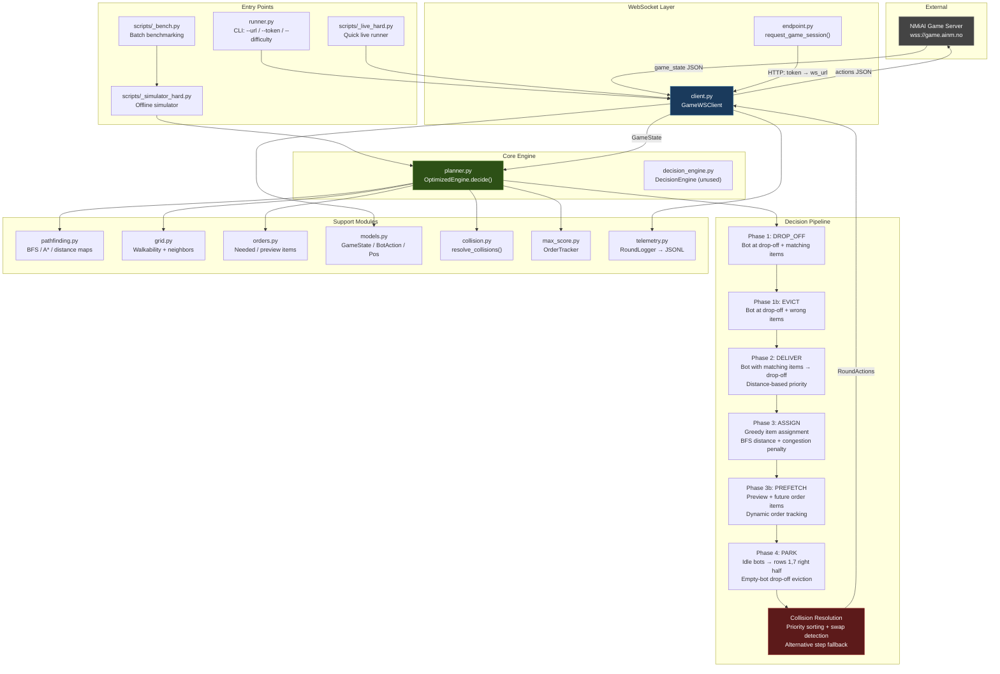
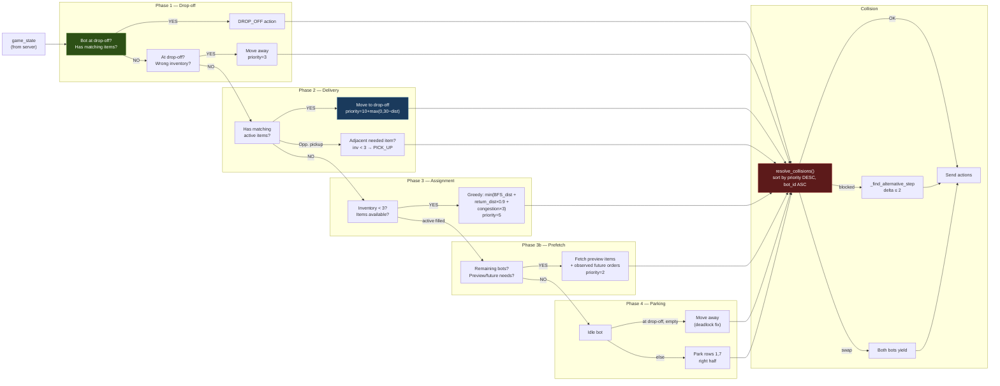
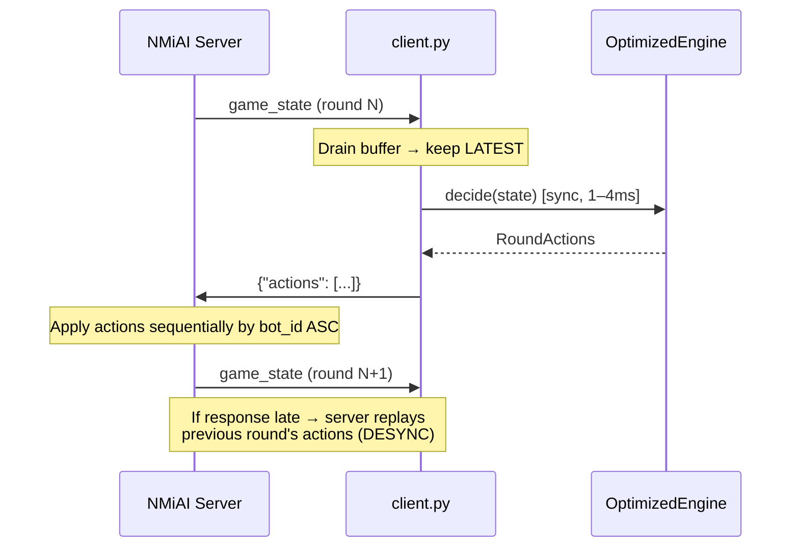
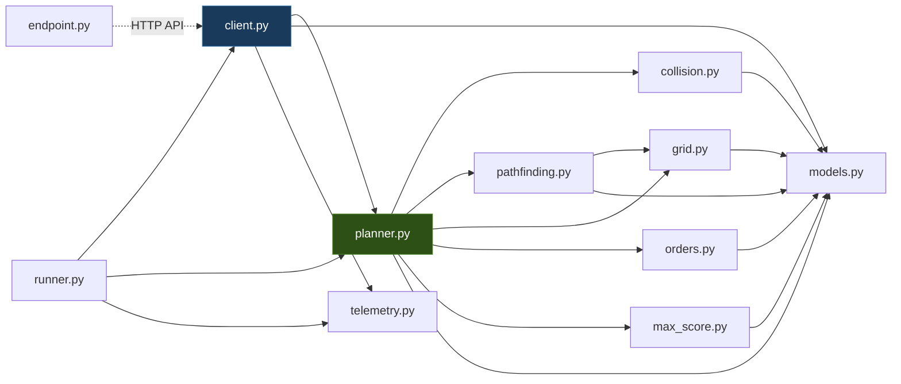

# NMiAI Grocery Bot — Architecture Diagram

## System Overview (Mermaid)



---

## Decision Pipeline (Phase Flow)



---

## WebSocket Communication Flow



---

## Grid Layout (Hard Map: 22×14)

```
Y  0  1  2  3  4  5  6  7  8  9 10 11 12 13 14 15 16 17 18 19 20 21
───────────────────────────────────────────────────────────────────────
0  W  W  W  W  W  W  W  W  W  W  W  W  W  W  W  W  W  W  W  W  W  W
1  W  .  .  .  .  .  .  .  .  .  .  .  .  .  .  .  .  .  .  .  .  W
2  W  .  W  S  A  S  W  .  W  S  A  S  W  .  W  S  A  S  W  .  .  W
3  W  .  W  S  A  S  W  .  W  S  A  S  W  .  W  S  A  S  W  .  .  W
4  W  .  W  S  A  S  W  .  W  S  A  S  W  .  W  S  A  S  W  .  .  W
5  W  .  W  S  A  S  W  .  W  S  A  S  W  .  W  S  A  S  W  .  .  W
6  W  .  W  S  A  S  W  .  W  S  A  S  W  .  W  S  A  S  W  .  .  W
7  W  .  .  .  .  .  .  .  .  .  .  .  .  .  .  .  .  .  .  .  .  W
8  W  .  W  S  A  S  W  .  W  S  A  S  W  .  W  S  A  S  W  .  .  W
9  W  .  W  S  A  S  W  .  W  S  A  S  W  .  W  S  A  S  W  .  .  W
10 W  .  W  S  A  S  W  .  W  S  A  S  W  .  W  S  A  S  W  .  .  W
11 W  .  .  .  .  .  .  .  .  .  .  .  .  .  .  .  .  .  .  .  .  W
12 W  D  .  .  .  .  .  .  .  .  .  .  .  .  .  .  .  .  .  .  B  W
13 W  W  W  W  W  W  W  W  W  W  W  W  W  W  W  W  W  W  W  W  W  W

Legend:
  W = Wall        S = Shelf (items on wall, pickup from A)
  A = Aisle       D = Drop-off (1,12)
  B = Bot start   . = Walkable corridor
```

---

## File Dependency Graph


